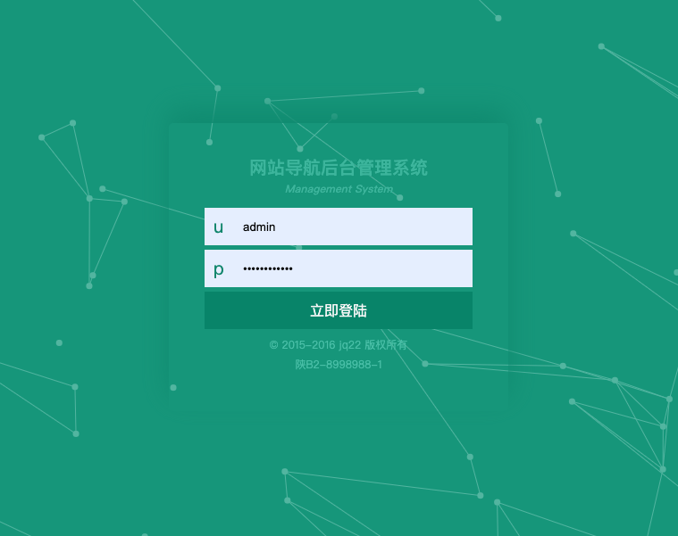
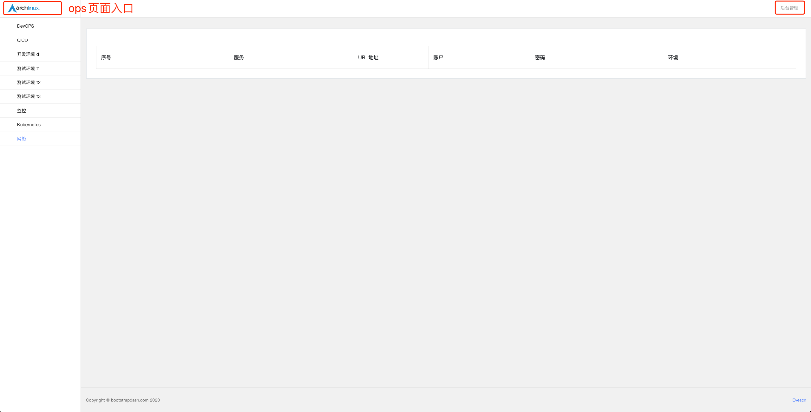

# site_navigation

> 网站导航服务

## 1. 服务镜像打包

```shell
$ git clone https://github.com/evescn/site_navigation.git

$ cd site_navigation

# 打包 Docker 镜像
$ docker build -t harbor.xxx.cn/devops/site_navigation:v1.0 -f Dockerfile .
$ docker push harbor.xxx.cn/devops/site_navigation:v1.0
```

## 2. 服务部署

### a | Docker 启动

```shell
$ docker run -d \
  --restart=always \
  --name site_navigation \
  -p 8080:8080 \
  harbor.xxx.cn/devops/site_navigation:v1.0
```

### b | Kubernetes 启动

```shell
# k8s.yaml
apiVersion: apps/v1
kind: Deployment
metadata:
  name: site-navigation
  namespace: devops
spec:
  replicas: 1
  selector:
    matchLabels:
      app: site-navigation
  template:
    metadata:
      labels:
        app: site-navigation
    spec:
      containers:
      - name: site-navigation
        image: harbor.xxx.cn/devops/site_navigation:v1.0
        imagePullPolicy: Always
        ports:
        - containerPort: 8080

---
# service
apiVersion: v1
kind: Service
metadata:
  name: site-navigation
  namespace: devops
spec:
  ports:
  - port: 80
    protocol: TCP
    targetPort: 8080
    nodePort: 30080
  selector:
    app: site-navigation
  type: NodePort

---
# ingress
apiVersion: networking.k8s.io/v1
kind: Ingress
metadata:
  name: site-navigation
  namespace: devops
spec:
  ingressClassName: nginx
  rules:
  - host: site.evescn.com
    http:
      paths:
      - path: /
        pathType: Prefix
        backend:
          service:
            name: site-navigation
            port:
              number: 80

$ kubectl apply -f k8s.yaml
```

## 3. 服务访问

### 服务地址

```shell
http://ip:8080/
```

### 后台地址

```shell
- http://ip:8080/ops/ （后台页面需要认证登陆）
- 默认账号：admin
- 默认密码：admin
```





> 默认账号密码，session缓存时间修改文件： /site_navigation/config/settings.py
